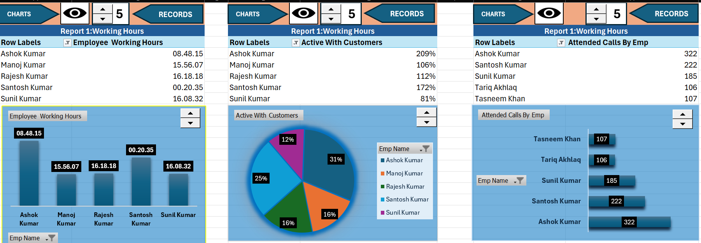

📊 Call Center Performance Analysis Dashboard --- Excel VBA & Macros

👤 Project Author

Saquib Alam

Project: Call Center Performance Analysis Dashboard
Platform: Microsoft Excel
File Type: .xlsm --- Excel Macro-Enabled Workbook
Core Technologies: Excel, VBA, Macros, Pivot Tables, Pivot Charts,
Formulas, Form Controls

📌 Project Overview

The Call Center Performance Analysis Dashboard is an interactive
Excel-based reporting and performance-monitoring project developed using
VBA, Excel Macros, Pivot Tables, Pivot Charts, and form controls.

The purpose of this project is to convert detailed call-center employee
activity data into a structured performance-reporting system. The
workbook brings together information about employee working hours, call
activity, customer interaction, efficiency, breaks, hold activity, and
other work-related metrics.

The dashboard provides a management-friendly view of overall employee
performance and allows users to explore summarized information rather
than manually reviewing hundreds of individual records.

This project demonstrates how Microsoft Excel can be used as a practical
business intelligence and reporting tool by combining data
preparation, formulas, automation, interactive controls, pivot-based
analysis, and dashboard visualization.

🎯 Project Objectives

The main objectives of this project are:

Analyze call-center employee performance in a structured way.

Monitor employee working hours and productive working time.

Analyze attended calls and customer interaction.

Measure employee work efficiency.

Track different types of employee breaks.

Analyze hold calls and call-handling behavior.

Summarize large employee-level datasets using Pivot Tables.

Present important performance indicators through Pivot Charts.

Use VBA and Macros to automate repetitive reporting tasks.

Use a Spinner Button/Form Control for interactive report navigation
or filtering.

Create a dashboard that can be used by supervisors, team leaders, or
management for performance monitoring.

🧩 Main Workbook Components

The workbook contains the following major worksheets:

1. Employee Break

This sheet focuses on employee break activity.

It contains fields such as:

Employee

Lunch

Normal Break

Feedback

Training

Meeting

Unwanted Break

Other Work

Total Break Taken

This section helps identify how employee working time is distributed
across different break and non-customer activities.

2. Efficiency

The Efficiency worksheet contains detailed productivity and
work-efficiency metrics.

Important fields include:

Total Working Hours

Work Efficiency

Attended Calls

Efficiency in Percentage

Active With Customer

Active Time

Other

Not Working %

Call Keeping

Break During Calls

Non Break %

% Other Work

Long Time

Short Time Holds

Long Call Holds

No Hold

These metrics provide a detailed view of how employees spend their
working time and how efficiently they handle customer interactions.

3. Overall Performance

This worksheet focuses on call-handling performance.

Key metrics include:

Attended Calls

Transferred Calls

Call Conferenced

Call Redirected

Hold Calls

% of Calls on Hold

Average Duration of Calls

Average In-Focus Hold Calls

Calls Unattended Time

This sheet helps evaluate call activity and customer-handling behavior
at employee level.

4. Summary

The Summary sheet combines important information from multiple
worksheets into a simplified reporting structure.

It uses Excel formulas and lookup-based calculations to bring together:

Employee

Employee Name

Total Number of Working Hours

Work Efficiency

Total Break Taken

Attended Calls

Active With Customer

This creates a centralized dataset that can be used for dashboard
reporting.

5. DASHBOARD

The DASHBOARD worksheet is the presentation layer of the project.

It uses summarized data and Pivot-based reporting to provide an
interactive management view of employee performance.

The dashboard/reporting area includes analysis such as:

Employee Working Hours

Active Time With Customers

Attended Calls by Employee

Employee-level performance comparisons

Summary-based performance reporting

The dashboard is designed to make the analysis easier to understand
without requiring the user to inspect raw employee-level records
manually.

📊 Dashboard Screenshot

The repository should contain the dashboard screenshot with the
filename:

dashboard.png

The image is displayed at the top of this README using:

Make sure dashboard.png is uploaded to the same folder as
README.md in the GitHub repository.

⚙️ Excel Features Used

🔹 VBA

VBA is used to support automation and interactive behavior inside the
macro-enabled workbook.

The VBA implementation helps reduce repetitive manual work and supports
dashboard/report interaction.

🔹 Excel Macros

Macros are used to automate reporting-related actions and improve the
usability of the workbook.

This makes the project more than a static Excel report; it functions as
an interactive reporting solution.

🔹 Pivot Tables

Pivot Tables are used to summarize employee-level information and create
meaningful aggregations.

They make it easier to analyze:

Employee performance

Working hours

Customer activity

Attended calls

Efficiency

Break behavior

🔹 Pivot Charts

Pivot Charts convert summarized Pivot Table data into visual reports.

They allow users to understand employee performance through charts
instead of reviewing raw tables.

🔹 Spinner Button / Form Control

A Spinner Button is incorporated into the workbook to provide
interactive control over the reporting/dashboard experience.

This type of Excel Form Control can be used to change a selected value,
employee, period, or dashboard view and make the report more
interactive.

🔹 Excel Formulas

The workbook uses formulas to connect and summarize information between
worksheets.

Examples of formula-driven operations include:

Employee name extraction

Lookup-based data retrieval

Time conversion

Performance summarization

Cross-sheet reporting

The Summary sheet uses lookup/formula logic to connect employee records
with efficiency, break, and overall performance information.

🔄 Data Flow

The overall reporting workflow can be understood as:

Employee-Level Data
        ↓
Employee Break Analysis
        ↓
Efficiency Analysis
        ↓
Overall Performance Analysis
        ↓
Summary / Lookup-Based Consolidation
        ↓
Pivot Tables
        ↓
Pivot Charts
        ↓
Interactive Dashboard
        ↓
Management Performance Insights

📈 Key Performance Areas

The project focuses on several important call-center KPIs.

Performance Area                    Purpose

Working Hours                       Measures total employee working
time

Work Efficiency                     Measures productive performance

Attended Calls                      Tracks customer calls handled

Active With Customer                Measures customer interaction time

Total Break Taken                   Tracks employee break duration

Hold Calls                          Measures calls placed on hold

Average Call Duration               Shows typical call-handling
duration

Transferred Calls                   Tracks calls transferred to another
employee/team

Conferenced Calls                   Tracks conference-based
interactions

Redirected Calls                    Tracks redirected calls

Unattended Time                     Helps identify missed/unattended
activity

🔍 Overall Analysis & Insights

The workbook is designed to provide insights into the relationship
between employee availability, customer interaction, call volume,
efficiency, and time utilization.

Employee Productivity

The Efficiency worksheet allows employees to be compared using working
hours, work efficiency, active customer time, and attended calls.

This helps identify differences in employee productivity and workload.

Customer Interaction

The Active With Customer and Attended Calls metrics provide
visibility into how much employee time is spent directly handling
customers.

Break & Non-Working Analysis

Break categories such as lunch, normal breaks, training, meetings,
feedback, unwanted breaks, and other work provide additional context
when reviewing employee productivity.

Call Handling

The Overall Performance worksheet provides information about attended,
transferred, conferenced, redirected, and held calls.

This makes it possible to study call-handling patterns rather than
relying only on total call counts.

Hold-Time Monitoring

Hold-related metrics can be used to identify employees or situations
where calls spend additional time on hold.

Management Reporting

Instead of reviewing multiple detailed worksheets independently, the
dashboard brings important information into a single reporting
environment.

This makes the workbook suitable as a demonstration of Excel-based
business reporting and operational analytics.

🧠 Technical Highlights

This project demonstrates practical knowledge of:

Microsoft Excel

Advanced Excel reporting

Excel VBA

Excel Macros

Pivot Tables

Pivot Charts

Form Controls

Spinner Button

Lookup formulas

Cross-sheet data consolidation

KPI reporting

Dashboard design

Data summarization

Operational performance analysis

Interactive reporting

🗂️ Suggested GitHub Repository Structure

Call-Center-Performance-Analysis/
│
├── README.md
├── Call Center Project (1).xlsm
└── dashboard.png

Important: Keep dashboard.png in the repository root if you want
the image to appear automatically at the top of the README.

🚀 How to Use the Project

Download the .xlsm workbook from this repository.

Open the file using Microsoft Excel.

If Excel displays a security warning, enable content/macros only if
you trust the workbook.

Open the DASHBOARD worksheet.

Use the available dashboard controls and Pivot-based reports.

Explore the employee-level analysis in:

Employee Break

Efficiency

Overall Performance

Summary

Refresh Pivot Tables/Pivot Charts when new source data is added.

Use the interactive controls to explore different performance views.

💼 Business Value

This project demonstrates how Excel can be transformed from a simple
spreadsheet into an interactive operational performance analytics
solution.

A call-center management team can use this type of report to:

Monitor employee productivity.

Review customer interaction levels.

Understand call volumes.

Analyze break utilization.

Review call-handling patterns.

Identify areas requiring further investigation.

Support regular performance-review meetings.

Reduce manual reporting effort through automation.

The dashboard is therefore focused on data-driven performance
monitoring and reporting rather than simply displaying raw data.

🛠️ Tools & Technologies

Tool / Technology   Usage

Microsoft Excel     Data analysis and dashboard
Excel VBA           Automation and interactive functionality
Excel Macros        Repetitive task automation
Pivot Tables        Data summarization
Pivot Charts        Data visualization
Form Controls       Dashboard interaction
Spinner Button      Interactive control
Excel Formulas      Data transformation and consolidation

📌 Project Highlights

✅ Excel Macro-Enabled Workbook

✅ VBA Automation

✅ Interactive Dashboard

✅ Pivot Tables

✅ Pivot Charts

✅ Spinner Button

✅ Employee Performance Analysis

✅ Call Center KPI Reporting

✅ Working Hours Analysis

✅ Break Analysis

✅ Customer Interaction Analysis

✅ Call Handling Analysis

✅ Consolidated Summary Report

🎓 Project Purpose

This project was created as a practical demonstration of Excel-based
data analytics, dashboard development, automation, and business
performance reporting.

It showcases the ability to take detailed operational data and transform
it into an interactive reporting solution using Microsoft Excel.

👨‍💻 Author

Saquib Alam

Data Analytics | Microsoft Excel | VBA | Dashboard Development |
Business Intelligence

⭐ If You Find This Project Useful

If this project helps you understand Excel dashboard development, VBA
automation, or call-center performance analytics, consider giving the
repository a ⭐ on GitHub.

📄 License

This project is intended for educational, portfolio, and demonstration
purposes.
